# 🎮 คู่มือสคริปต์การนำเสนอ (Presentation Guide)
## โครงการ: Steam Games Intelligence & Machine Learning Pipeline

---

## ⏱️ โครงสร้างเวลาในการนำเสนอ (แนะนำ 6–8 นาที)

```mermaid
gantt
    title ลำดับการนำเสนอ (Presentation Timeline - 5 Tabs Focus)
    dateFormat  m
    axisFormat %M นาที
    
    1. บทนำ & สถาปัตยกรรมระบบ (Architecture) :0, 2m
    2. สาธิต Tab 1 อันดับเกมยอดนิยม (Overview) :2, 3m
    3. [Highlight ML] Tab 2 AI Discount Radar :3, 5m
    4. Tab 3 แนวโน้ม & Tab 4 World Heatmap :5, 7m
    5. Tab 5 Value Score & สรุปภาพรวม (Conclusion) :7, 8m
```

---

## 🎤 สคริปต์การพูดแต่ละช่วง (Step-by-Step Script)

---

### ช่วงที่ 1: บทนำและภาพรวมระบบ (1–2 นาที)
**🎯 จุดประสงค์:** แนะนำโจทย์, คุณค่าของโปรเจกต์ และสถาปัตยกรรม End-to-End Data Platform

* **คำพูดเปิด:**
  > *"สวัสดีครับอาจารย์และเพื่อนๆ ทุกท่าน วันนี้ผมขอแนะนำโปรเจกต์ **Steam Intelligence & Machine Learning Pipeline** ซึ่งเป็นระบบวิเคราะห์ข้อมูลเกมยอดนิยมบน Steam แบบ **End-to-End** ตั้งแต่การดึงข้อมูลสด, การประมวลผลผ่าน Data Pipeline อัตโนมัติบน Airflow, การพัฒนา **Machine Learning แบบ Dual-Model เพื่อพยากรณ์โอกาสและราคาที่จะลดล่วงหน้า 7 วัน** ไปจนถึงการแสดงผลบน Interactive Dashboard"*

* **พูดถึงสถาปัตยกรรมเทคโนโลยี (Tech Stack):**
  * **Data Pipeline:** **Apache Airflow** จัดการ Orchestration อัตโนมัติรายวัน
  * **Hybrid Ingestion:** ดึงคนเล่นสดจาก **Valve Official API**, ราคาเงินบาทจาก **Steam Store API**, และสถิติรีวิวจาก **SteamSpy API**
  * **Database:** **PostgreSQL** สำหรับจัดเก็บข้อมูล Time-series
  * **Machine Learning:** **Scikit-Learn (Dual-Model RandomForest)**
  * **UI/UX Dashboard:** **Streamlit + Plotly + Remix Icons** ดีไซน์สไตล์ Modern Minimal

---

### ช่วงที่ 2: ส่วนหัว Dashboard & Tab 1 (1 นาที)

#### 1. Header & Status Bar
* **จุดที่ชี้ให้ดู:** Status Bar ด้านบน (`Data Pipeline Active`, `ข้อมูลล่าสุด`, `รอบการดึง`)
* **บทพูด:**
  > *"ด้านบนสุดจะเป็น Status Bar แสดงสถานะของ Pipeline และรอบการซิงค์ข้อมูลล่าสุดจาก PostgreSQL ซึ่งเชื่อมต่อกับ Apache Airflow โดยอัตโนมัติ"*

#### 2. Tab 1: อันดับเกมยอดนิยม (Top Games)
* **จุดที่ชี้ให้ดู:** การจัดอันดับ (#1 Gold, #2 Silver, #3 Bronze), ราคาบาทไทย, Badge ส่วนลด, ยอดคนเล่นสด (CCU)
* **บทพูด:**
  > *"ในแท็บแรก **อันดับเกมยอดนิยม** แสดงรายการเกม Top Tier เช่น CS2, PUBG, Elden Ring, Wukong พร้อมแปลงราคาเป็นเงินบาทไทยแท้จริง และแสดงยอดผู้เล่นออนไลน์พร้อมกันแบบ Real-time ณ ปัจจุบัน สามารถจัดเรียงตามยอดผู้เล่น, คะแนนรีวิว หรือส่วนลดสูงสุดได้ครับ"*

---

### ช่วงที่ 3: 🌟 [จุดเด่น ML หลัก] Tab 2: ดีลและส่วนลด AI (AI Discount Radar) (2–3 นาที)
> [!IMPORTANT]
> **หน้านี้คือหัวใจหลักของ Machine Learning ในโปรเจกต์ เน้นอธิบายให้ชัดเจนและมั่นใจ**

* **จุดที่ชี้ให้ดู:** การ์ด **AI Discount Radar (3 กล่องด้านบน)** ที่มีป้ายคำแนะนำ `แนะนำให้รอก่อน (WAIT)`, `จับตาดูราคา (WATCH)`, `ไม่ต้องรอ (โอกาสลดต่ำ)` และตัวเลขราคาคาดการณ์
* **บทพูดอธิบายหลักการ ML (เจาะลึก Dual-Model):**
  > *"ไฮไลท์สำคัญของระบบ Machine Learning อยู่ในแท็บที่ 2 ครับ คือ **AI Discount Radar** ซึ่งทำงานร่วมกันแบบ **Dual-Model Machine Learning**:
  >
  > 1. **Model ที่ 1 (Classifier): ทำนาย 'จังหวะเวลา' (Timing)** ➔ ดูว่าใน 7 วันนี้ มีโอกาสจะจัดโปรลดราคากี่ % (เช่น โอกาสลด 85%) โดยวิเคราะห์จากรอบความถี่และวันที่ไม่ได้ลดราคามานาน
  > 2. **Model ที่ 2 (Regressor): ทำนาย 'ราคาที่จะลดเหลือ' (Price Forecast)** ➔ คาดการณ์ว่าถ้าจัดโปร ราคาจะลดเหลือเงินกี่บาท (เช่น จากราคา ฿1,799 คาดว่าจะลดเหลือ ฿899) โดยประเมินจากประวัติส่วนลดเดิมของเกมนั้น
  > 3. **Decision Recommendation Engine:** รวมผลทั้งสองตัวเป็นคำแนะนำผู้ซื้อทันที:
  >    * ถ้าโอกาสลดสูง (≥ 70%) ➔ แนะนำ **'แนะนำให้รอก่อน (WAIT)'** เพราะกำลังจะลดราคาเร็วๆ นี้ อย่าเพิ่งซื้อราคาเต็ม
  >    * ถ้าโอกาสลดปานกลาง (40–69%) ➔ แนะนำ **'จับตาดูราคา (WATCH)'**
  >    * ถ้าโอกาสลดต่ำ (< 40%) ➔ แนะนำ **'ไม่ต้องรอ (โอกาสลดต่ำ)'** (เพราะ 7 วันนี้ไม่ลดแน่นอน ผู้ใช้มั่นใจกดซื้อได้เลย)
  >
  > ด้านล่างยังมีชาร์ตเปรียบเทียบราคาเต็ม vs ราคาโปรโมชั่น สำหรับเกมที่กำลังลดราคาอยู่จริง ณ วันนี้ด้วยครับ"*

---

### ช่วงที่ 4: Tab 3 & Tab 4 (แนวโน้มผู้เล่น & แผนที่โลก) (1–2 นาที)

#### 1. Tab 3: สถิติแนวโน้มผู้เล่น (CCU Trends)
* **จุดที่ชี้ให้ดู:** กราฟเส้นแนวโน้มรายวัน (Time-series) และการเปรียบเทียบหลายเกม
* **บทพูด:**
  > *"ในแท็บที่ 3 จะแสดงแนวโน้มผู้เล่นรายวัน (Time-series) ย้อนหลัง ทำให้เห็นพฤติกรรมผู้เล่นชัดเจน เช่น ช่วงวันหยุดสุดสัปดาห์ที่ยอดผู้เล่นจะเพิ่มขึ้น"*

#### 2. Tab 4: ผู้เล่นแยกตามโซน (Regional Player Distribution & World Heatmap)
* **จุดที่ชี้ให้ดู:** เมตริกคนเล่นในไทย (กี่คน / กี่ % ของโลก), แผนที่โลก **Choropleth Heatmap**, และ **Peak Hours (เวลาไทย UTC+7)**
* **บทพูด:**
  > *"ในแท็บที่ 4 คือการวิเคราะห์สัดส่วนผู้เล่นแยกตามภูมิภาคทั่วโลกและรายประเทศ เช่น มีคนเล่นในประเทศไทยกี่คน คิดเป็นสัดส่วนเท่าไหร่ของโลก และแสดงแผนที่ความหนาแน่นระดับโลก พร้อมทั้งระบุช่วงเวลา **Peak Hours** ของแต่ละโซนโดยคำนวณแปลงเป็นเวลาไทย (UTC+7) เรียบร้อยครับ"*

---

### ช่วงที่ 5: Tab 5 & สรุปจบ (1 นาที)

#### 1. Tab 5: วิเคราะห์ความคุ้มค่า (Value Score)
* **จุดที่ชี้ให้ดู:** Scatter Plot (แกน X: ราคา, แกน Y: คะแนนรีวิว, ขนาดจุด: ยอดคนเล่น)
* **บทพูด:**
  > *"แท็บสุดท้ายคือ **Value Score Analysis** คำนวณจากสัดส่วน `คะแนนรีวิว (%) / ราคา (บาท)` เกมที่อยู่ **มุมบนซ้ายของกราฟ** คือเกมที่ได้คะแนนรีวิวสูงมากในราคาที่ประหยัดที่สุด ซึ่งช่วยให้ผู้ใช้งานเลือกซื้อเกมได้อย่างคุ้มค่าเงินมากที่สุด"*

#### 2. สรุปปิดท้าย (Conclusion)
* **บทพูดปิด:**
  > *"สรุปโปรเจกต์นี้เป็นการผสาน **Data Platform ครบวงจร**:
  > * มี **Airflow** จัดการ Data Pipeline อัตโนมัติทุกวัน
  > * มี **PostgreSQL** จัดเก็บข้อมูล Time-series
  > * มี **Machine Learning (Dual-Model)** ช่วยพยากรณ์โปรโมชั่นลดราคาล่วงหน้าและแนะนำการซื้อ
  > * มี **Streamlit** แสดงผลแบบ Real-time ใช้งานง่าย
  >
  > ขอขอบคุณทุกท่านครับ ยินดีตอบข้อซักถามครับ"*

---

## ❓ รวมคำถามที่อาจารย์ชอบถาม (Q&A Cheat Sheet)

* **Q: ทำไมเลือกใช้ Dual-Model (Classifier + Regressor) แทนที่จะใช้โมเดลเดียว?**
  * *A:* เพราะปัญหาการลดราคาเป็น 2 ขั้นตอน (Two-stage Decision): ขั้นแรกคือ "จะลดหรือไม่ลด" (Binary Classification) และขั้นที่สองคือ "ถ้าลด จะลดกี่เปอร์เซ็นต์" (Continuous Regression) การแยก 2 โมเดลทำให้โมเดลที่สองไม่ต้องถูกรบกวนด้วยเกมที่ไม่ลดราคา (Zero-inflation) ทำให้ความแม่นยำสูงกว่าการใช้ Regressor ตัวเดียวมากครับ
* **Q: ถ้า API ของ Steam ล่ม Pipeline จะพังไหม?**
  * *A:* ไม่พังครับ เพราะใน Airflow ออกแบบให้มีกลไก Retry อัตโนมัติ 2 ครั้ง และมี Fallback ไปดึงข้อมูลจากแหล่งสำรอง ทำให้ Pipeline มีความทนทาน (Fault-tolerant) ครับ
